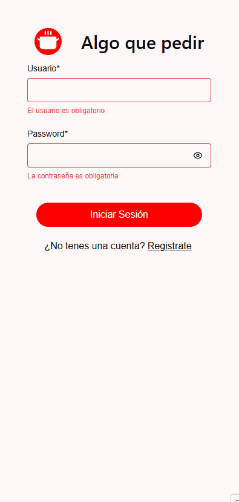
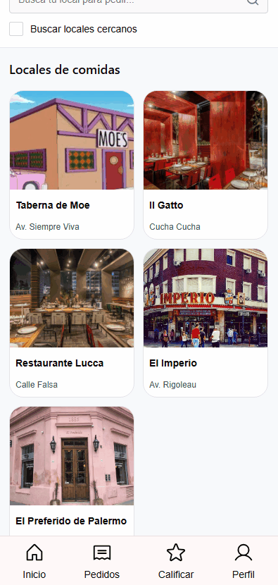
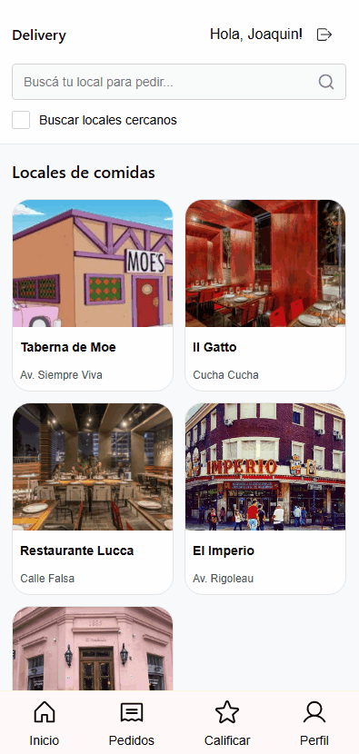
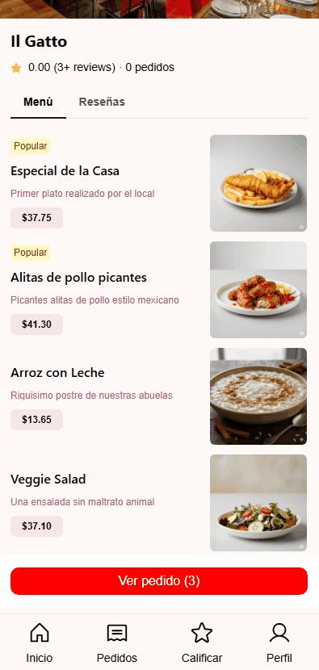
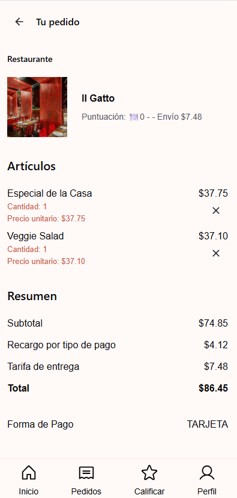
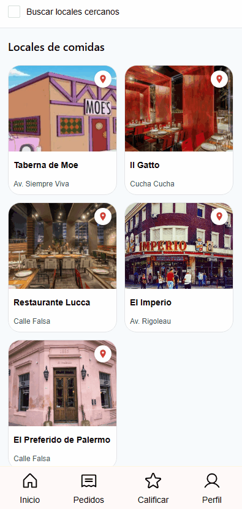

# Algo Que Pedir - Frontend (React)

Este es el repositorio del frontend para el proyecto **Algo Que Pedir**, desarrollado como parte de un trabajo grupal universitario para la materia **Algoritmos 3** de la **Universidad Nacional de San Martín (UNSAM)**.

## Sobre el Proyecto

**Algo Que Pedir** es una aplicación de pedidos de comida donde los usuarios pueden elegir entre distintos locales y realizar pedidos de manera simple.

El sistema se encuentra conectado a un backend desarrollado con **Spring Boot** y **Kotlin**, el cual puede encontrarse en el siguiente repositorio:
 [Backend Repo - Algo Que Pedir](https://github.com/joanavarro23/algo-que-pedir-backend.git)

## Funcionalidades Principales

La aplicación ofrece un flujo completo desde el descubrimiento de locales hasta el seguimiento de pedidos realizados:

*   **Gestión de Usuario:** Registro e inicio de sesión.
*   **Perfil y Preferencias:** Configuración de criterios de búsqueda (cercanía, precio, popularidad) y gestión de ingredientes preferidos o a evitar.
*   **Exploración de Locales:** Visualización de locales gastronómicos disponibles con información relevante sobre su oferta y distancia.
*   **Armado de Pedidos:** Selección de platos, gestión de cantidades y visualización del carrito en tiempo real.
*   **Proceso de Checkout:** Selección de medios de pago y confirmación del pedido con desglose de costos (subtotal, envío y recargos).
*   **Historial y Seguimiento:** Consulta de pedidos anteriores y visualización detallada del estado de cada orden.
*   **Calificaciones:** Posibilidad de puntuar y dejar reseñas sobre los locales para ayudar a otros usuarios.

## Pantallas de la Aplicación

El sistema está estructurado en las siguientes secciones principales:

1.  **Login y Registro:** Puerta de entrada para los usuarios del sistema.

2.  **Home (Listado de Locales):** Vista principal donde se pueden buscar y filtrar locales gastronómicos.

3.  **Detalle del Local:** Vista de los platos ofrecidos por un local específico, permitiendo agregarlos al carrito.

4.  **Checkout:** Pantalla para finalizar la compra, elegir el método de pago y confirmar la transacción.

5.  **Perfil del Usuario:**
    *   **Información Personal:** Datos básicos del usuario.
    *   **Preferencias:** Configuración de ingredientes (preferidos/evitar) y criterios de búsqueda personalizados.

6.  **Mis Pedidos:** Listado histórico de todos los pedidos realizados por el usuario.

7.  **Detalle del Pedido:** Información exhaustiva de un pedido específico (ítems, costos, estado).

8.  **Calificar Local:** Interfaz para brindar feedback sobre la experiencia en un local determinado.

## Tecnologías Utilizadas

*   **React 19** con **TypeScript**
*   **Vite** (Build Tool)
*   **Chakra UI v3** (Sistema de diseño y componentes)
*   **React Router Dom** (Navegación)
*   **Axios** (Comunicación con la API REST)
*   **Vitest** & **React Testing Library** (Testing)